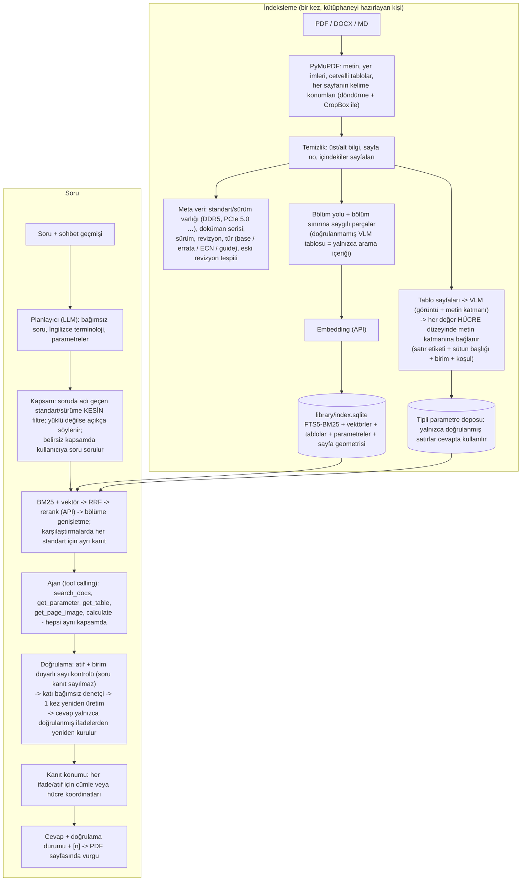

# TechRAG — Arayüz ve Tasarım Standartları için Doğrulamalı Asistan

Kullanıcının arayüz/standart sorularını (ARINC, JEDEC DDR, PCIe, Ethernet, DisplayPort, USB, RS-422, I²C,
genel tasarım standartları …) **yalnızca yüklü dokümanlardan** cevaplayan, her ifadeyi **[n] atfıyla kaynağına**
bağlayan, ifadeleri kullanıcıya göstermeden önce **kaynaklara karşı denetleyen** ve atfa tıklanınca dayanılan
cümleyi / tablo hücresini **PDF sayfası üzerinde vurgulayan** bir masaüstü uygulaması.

Öncelik doğruluktur: kanıt yetersizse uygulama "bulunamadı" der; doğrulanamayan bir ifadeyi kesin bilgi olarak
göstermez. Bu, hatasızlık garantisi değildir — denetimler yanlışların bir kısmını yakalar, bir kısmı kaçabilir
(bkz. "Bilinen sınırlar"). Doğruluk ancak kendi dokümanlarınızla, uzman onaylı bir soru setiyle ölçülebilir (§5).

* Windows için tek `TechRAG.exe` (tarayıcı açılmaz; yerel pencere — Microsoft Edge WebView2).
* Tüm modeller kurum içindeki **vLLM / SGLang** sunucularından (OpenAI uyumlu API) kullanılır:
  sohbet modeli, görsel model, embedding ve reranker ayrı ayrı ayarlanır. Yerelde ağır hiçbir şey çalışmaz.
* Arayüz Türkçe / İngilizce (tek tıkla değişir). Cevap, sorunun dilinde verilir; teknik terimler İngilizce kalır.

---

## 1. Mimari



### Hatalara karşı katmanlar

| Hata kaynağı | Önlem |
|---|---|
| Yanlış standart / sürüm (DDR4 değeri DDR5 cevabında) | Dokümanlar standart+sürüm varlığıyla etiketlenir. Soruda adı geçen standart aramayı **kesin** olarak o etiketi taşıyan dokümanlara daraltır; **etiketsiz dokümanlar kesin eşleşme sayılmaz**. İstenen standart/sürüm yüklü değilse kapsam **genişletilmez**: cevap "yüklü dokümanlarda yok" der ve ilgili yüklü dokümanları listeler. Araçlar (arama, parametre, tablo, sayfa görüntüsü) aynı kapsamı ve kullanıcının doküman/koleksiyon seçimini uygular; başka bir sürüme kaçamaz. Karşılaştırmalarda her standardın kanıtı ayrı toplanır. Standart adı verilmemişse ve kanıt kardeş sürümlerden (DDR4/DDR5 …) geliyorsa sistem cevap yerine **hangi sürümü kastettiğinizi sorar**. |
| Revizyon / belge türü karışması | Kimlik alanları ayrıdır: standart, doküman serisi (JESD79-5, "PCI Express Base", "PCI Express CEM"), sürüm, revizyon, tür. Yalnızca **aynı serinin aynı sürümünün** eski revizyonu yenisiyle geçersiz olur; Base ile CEM veya bir tasarım kılavuzu birbirinin revizyonu sayılmaz. Guide/appnote "bilgilendirici, spesifikasyonu geçersiz kılmaz" diye işaretlenir. Errata/ECN yalnızca ilgili serinin ilgili sürümüne bağlanır ve mümkünse maddeye (§4.2.6.3) bağlanır. Eski bir revizyonu soruda açıkça adlandırırsanız (ör. "JESD79-4B") o revizyon kullanılır. Kaynaklar farklı değer veriyorsa model çelişkiyi iki atıfla belirtmek zorundadır. |
| Tablo hücresinin yanlış okunması (min/max yer değişimi, yanlış birim, yanlış satır) | VLM yalnızca yapı önerir. Her değer, PDF metin katmanında **parametre satırı ile sütun başlığının (ve çok seviyeli başlıkta grup başlığının) kesiştiği tek hücrede** bulunmalı; birim satırda/başlıkta yazmalı; koşullar (8 Gb, DDR4-3200 …) sayfada ve gerekiyorsa aynı satırda olmalı. Sayfada başka yerde geçen aynı sayı kabul edilmez; iki eşit aday varsa belirsizdir. Doğrulanamayan satır **cevapta kullanılmaz** (araçla da geri alınamaz). `max(10 ns, 4 tCK)` gibi ifadeler tek sayıya indirgenmez; bilinmeyen birimler ve "1,200" gibi belirsiz sayı biçimleri SI değerine çevrilmez. |
| VLM birleştirmesinde veri kaybı | Birleştirme **tablo bazındadır**: yalnızca doğrulanmış ve içerik + konum + başlıkla güvenilir eşleşen PDF tablosu değiştirilir. Doğrulanmayan VLM tablosu hiçbir şeyin yerine geçmez; orijinal PDF metni kanıt olarak kalır, VLM sürümü yalnızca aramada kullanılır. |
| Model "biliyorum" diye uyduruyor | Cevap sözleşmesi: giriş cümlesi dahil her teknik ifade [n] atıflı; mühendislik yorumu dayandığı kaynakları ve varsayımlarını gösterir. Atıfsız teknik ifade (başlıktan önce veya sonra, sayılı veya sayısız) denetimden kaçamaz. |
| Sorudaki değerin "standart değeri" gibi sunulması | Kullanıcının verdiği değerler ayrı bir **kullanıcı girdisi** kaynağıdır; belgeye dayanan ifadeler yalnızca atıf yapılan belge metniyle doğrulanır. Kullanıcı değeri hesapta kullanılabilir ama standart değeri gibi sunulamaz. |
| Hesap hatası / kaynaksız girdi | Hesaplar `calculate` aracıyla yapılır; ifadedeki her sayı bir kaynağa veya kullanıcı girdisine **izlenir**. Kaynaksız girdi içeren hesap, aritmetiği doğru olsa da doğrulanmış ifadeyi desteklemez. |
| Yine de hatalı ifade | **Deterministik kontrol** (atıf var mı, sayı+birim atıf yapılan kaynakta mı — 0,35 µs = 350 ns) → **bağımsız denetçi** (taze bağlam: yalnızca iddia + atıf yapılan kaynak). Denetçinin yalnızca o iddia kimliği için açık ve geçerli bir "supported" kararı onay sayılır; zaman aşımı, API hatası, bozuk/eksik/tekrarlı karar **onay değildir** (bir kez yeniden denenir). Desteklenmeyen ifadeler bir kez yeniden ürettirilir; cevap yalnızca **doğrulanmış ifadelerden** yeniden kurulur. |

### Doğrulama durumları

Her ifade için: **destekleniyor** · **desteklenmiyor** · **doğrulanamadı** (kontrol tamamlanamadı, ör. denetçi
hata verdi) · **uygulanmadı** (doğrulama veya denetçi Ayarlar'da kapalı). Cevap düzeyinde: tümü doğrulandı /
bazıları çıkarıldı / bulunamadı / doğrulama tamamlanamadı / uygulanmadı / kapsam soruldu. "Denetçi çağrıldı" ile
"denetçi başarıyla tamamlandı" ayrı alanlardır; arayüz yalnızca kontrol denendi diye "doğrulandı" demez.
Akış sırasında yazılan taslak yalnızca ilerleme olarak (katlanmış, "doğrulanmamış" etiketiyle) gösterilir.

### Yerel hesaplama bütçesi

| Yerelde (exe) | Sunucuda (vLLM) |
|---|---|
| PDF ayrıştırma (PyMuPDF), kelime konumlarının çıkarılması (~2 ms/sayfa, indekslemede bir kez), sayfa render (yalnızca VLM sayfaları ve görüntülenen sayfalar), SQLite FTS5, numpy ile vektör arama, birim/sayı doğrulama, hücre eşleştirme ve kanıt konumu (cevap başına onlarca ms) | Sohbet + görsel model, embedding, reranker |

Exe ~65 MB (tek dosya); GPU, torch veya model dosyası gerektirmez. Sayfa geometrisi indekste sayfa başına
yaklaşık 4–8 KB yer kaplar (1000 sayfalık bir standart ≈ 5–8 MB). Vurgulama için tıklama başına model çağrısı
yapılmaz; konumlar indekslemede bir kez çıkarılır.

**Soru başına LLM çağrısı (doğruluk öncelikli mod):** planlayıcı 1 + cevap 1 (+ araç turları, en fazla 4) +
denetçi 1–2 (paralel; geçerli karar gelmeyen iddialar için en fazla 1 tekrar) + gerekirse yeniden üretim 1 +
yeniden denetim. Embedding 1, rerank 1 istek (karşılaştırma sorularında standart başına 1). Standart yüklü
değilse veya kapsam soruluyorsa cevap modeli hiç çağrılmaz.

---

## 2. Kurulum

### 2.1 Exe'yi almak

GitHub Actions her push'ta Windows derlemesi yapar (**Actions → Build Windows exe → Artifacts → TechRAG-windows**):

* `TechRAG-portable.exe` — tek dosya, kopyala-çalıştır.
* `TechRAG-win64.zip` — klasör sürümü (daha hızlı açılır; `TechRAG.exe` içinde).

`v*` etiketi atılırsa (ör. `git tag v1.0.0 && git push --tags`) dosyalar GitHub Release'e de eklenir.
Derleme, dondurulmuş exe üzerinde `TechRAG.exe selftest` çalıştırarak PDF ayrıştırma, indeksleme, arama,
gömülü arayüz ve pywebview'in pakete girdiğini doğrular. Exe'yi kapalı ağa normal dosya olarak taşıyın.

**Gereksinim:** Microsoft Edge **WebView2 Runtime** (Windows 11'de hazır; Windows 10'da yoksa Microsoft'un
"Evergreen Standalone Installer" çevrimdışı kurulumunu bir kez çalıştırın).

### 2.2 Model sunucuları (vLLM)

`deploy/vllm-serve-example.sh` dört uç nokta için örnek komutları içerir. Önemli bayraklar:

* Sohbet modeli: `--enable-auto-tool-choice --tool-call-parser hermes` (araçlar için) ve
  `--reasoning-parser qwen3` (düşünme metni cevaba karışmasın). Görsel giriş için `--limit-mm-per-prompt`.
  Modelinizin kartında önerilen parser adlarını kullanın.
* Embedding: `--runner pooling` (eski sürümlerde `--task embed`), ör. Qwen3-Embedding-0.6B.
* Reranker: Qwen3-Reranker için `--hf_overrides` (dosyada); bge-reranker-v2-m3 ek ayar istemez.

Sunucu araç çağrısını desteklemiyorsa uygulama bunu fark eder ve araçsız (ön-getirilmiş kaynaklarla) devam eder.

### 2.3 İlk açılış: Ayarlar

**Ayarlar** penceresinde her servis için **API adresi** (`http://sunucu:8000/v1`), **API anahtarı** ve
**Model** girilir. Model listesi sunucunun `/v1/models` ucundan **otomatik çekilir** ve açılır listede gösterilir;
**Test et** düğmesi bağlantıyı ve modeli dener (embedding boyutu, rerank skoru, LLM cevabı).

* Görsel model: "Sohbet modeliyle aynı" (çok kipli Qwen: şekil sayfaları cevap modeline görüntü olarak gider)
  veya ayrı bir VLM (sohbet modeli yalnızca metin alıyorsa sayfa görüntüleri VLM tarafından metne dökülür).
* Düşünme modu: `auto` (karşılaştırma / çok parçalı sorularda açık), `on`, `off`; kontrol yöntemi
  `chat_template` (Qwen `enable_thinking`) veya `reasoning_effort`.
* Doğrulanamayan iddialar: **Kaldır** (varsayılan) veya **İşaretle**.

Ayarlar `%APPDATA%\TechRAG\settings.json` dosyasına yazılır; API anahtarları **Windows DPAPI** ile kullanıcı
hesabına bağlı şifrelenir.

---

## 3. Kütüphane

```
<kütüphane>\
├── sources\
│   ├── arinc\        ARINC_429P1-19.pdf, ARINC_664P7.pdf ...
│   ├── ddr\          JESD79-4C_DDR4.pdf, JESD79-5B_DDR5.pdf ...
│   ├── pcie\         PCIe_Base_5.0.pdf, PCIe_CEM_4.0.pdf, PCIe_Base_5.0_Errata.pdf ...
│   ├── ethernet\  displayport\  usb\  rs422\  i2c\  general\
│   └── <yeni-grup>\  (tanımsız klasör otomatik olarak yeni koleksiyon olur)
├── index.sqlite      (FTS5 + vektörler + tablolar + parametreler)
└── cache\vlm\        (VLM ve meta veri sonuçları; aynı sayfa ikinci kez ücretlendirilmez)
```

* Varsayılan konum `%USERPROFILE%\TechRAG\library`; **Kütüphane** penceresinden değiştirilir.
* **Doküman ekle**: koleksiyon (klasör) seçin, dosyaları seçin → kopyalanır ve indekslenir (ilerleme görünür).
  Dosya adına standart ve sürümü yazmak etiketlemeyi kesinleştirir (`JESD79-5B_DDR5.pdf`, `PCIe_Base_5.0.pdf`).
  Errata/ECN dosyalarının adında "Errata"/"ECN" geçsin.
* Standart/sürüm kalıpları `techrag/resources/domains.yaml` içindedir (koleksiyon klasörleri, desenler,
  kısaltma sözlüğü, Türkçe→İngilizce terimler). Yeni bir standart ailesi bir YAML bloğu ile eklenir.
* Taranmış PDF'ler önce OCR'dan geçirilmeli (`ocrmypdf`); metin katmanı olmayan sayfalarda ne tablo
  değerleri doğrulanabilir ne de kanıt konumu gösterilebilir (uygulama sahte konum üretmez).
* Orijinal PDF'ler değiştirilmez: vurgular yalnızca arayüz katmanında çizilir, PDF'e annotation yazılmaz.

**Eski sürümle indekslenmiş kütüphane (0.1.x):** açılışta şema yerinde güncellenir; eski sürümün sayfa
düzeyi kontrolle "doğrulanmış" saydığı parametre satırları ve VLM tabloları güvenilmez kabul edilir (cevapta
kullanılmaz). Arayüzde uyarı çıkar. **Kütüphane → "Konum verisini oluştur (hızlı geçiş)"** (veya
`TechRAG.exe migrate`) kaynak PDF'lerden sayfa geometrisini çıkarır ve önbellekteki VLM tablolarını hücre
düzeyinde yeniden doğrular — **yeniden embedding ve VLM çağrısı yapmaz**. Eski sürüm, doğrulanan VLM tablosunun
orijinal PDF metnini indekse koymuyordu; hücre düzeyinde doğrulanamayan bu tür tablolar için geçiş raporu tam
yeniden indeksleme önerir (`ingest --rebuild`: VLM sonuçları önbellekten gelir, yalnızca embedding yeniden
hesaplanır). Salt-okunur paylaşılan kütüphaneler yerinde güncellenemez: hazırlayan kişi geçişi yapıp yeniden
yayımlamalıdır.

**Paylaşım:** kütüphaneyi hazırlayan kişi **Kütüphane → Yayımla** ile temiz bir kopya üretir (tek dosya
indeks + kaynaklar + VLM önbelleği). Diğer kullanıcılar bu klasörü (ağ paylaşımı dahil, `\\sunucu\paylaşım\...`)
**salt-okunur** açar: kilit kullanmaz, ağ paylaşımında güvenlidir. Güncellemeyi yeni bir klasöre yayımlayıp
kullanıcıların onu açması önerilir (açıkken üzerine yazmayın).

---

## 4. Kullanım

* **Soru:** Sorunuzu yazın. Soruda geçen standart/sürüm kapsamı belirler ("kapsam: DDR5"); soldan doküman veya
  koleksiyon seçerek kapsamı elle de daraltabilirsiniz (seçim araç çağrılarında da korunur). Standart yüklü
  değilse "yüklü değil: DDR5" görünür ve cevap uydurulmaz. Kapsam belirsizse seçenek düğmeleri çıkar.
* **Cevap akışı:** taslak, "doğrulanmamış" etiketli katlanmış bir alanda ilerleme olarak görünür; araç
  çağrıları ve isteğe bağlı model düşünmesi listelenir. Doğrulama bitince yalnızca doğrulanmış ifadelerden
  kurulan son cevap gösterilir.
* **Doğrulama kutusu:** cevap durumu, denetçinin tamamlanıp tamamlanmadığı, çıkarılan/işaretlenen ifadeler
  (gerekçesiyle) ve "İfade ayrıntıları" (her ifadenin durumu; kullanıcı girdisi / hesap içerip içermediği).

### PDF'de kanıt vurgulama

1. Cevaptaki **[n]** atfına tıklayın: sağdaki kaynak paneli doğru dokümanı ve sayfayı açar.
2. O ifadeyi destekleyen **cümle**, ya da tablo değerlerinde **değer hücresi + parametre adı + sütun başlığı
   (+ birim, grup başlığı, dipnot)** sayfa üzerinde renkli kutularla işaretlenir. Aynı sayı sayfada birkaç yerde
   geçiyorsa yalnızca satır/sütun ilişkisiyle eşleşen hücre işaretlenir; eşleşme belirsizse hiçbiri.
3. **‹ Önceki kanıt / Sonraki kanıt ›** ile bölgeler (başka sayfalardakiler dahil) arasında gezinin;
   **Vurgu** kutusu vurguyu gizler/gösterir; **− / +** yakınlaştırır (vurgu hizası korunur).
4. Panelde iki ayrı durum görünür: **Doğrulama** (ifade kaynakla destekleniyor mu) ve **Konum** (kanıt sayfada
   bulundu mu). Konum bulunması ifadenin doğru olduğu anlamına gelmez.
5. Kesin yer bulunamazsa "Kaynak sayfası bulundu, kesin konum eşleştirilemedi" yazar; metin katmanı yoksa veya
   kütüphane eski sürümle indekslenmişse bu da açıkça söylenir. PDF olmayan kaynaklarda kanıt metin içinde
   işaretlenir. **Hesap** kaynaklarında sonuç PDF'te aranmaz; girdileri ve her girdinin kaynağı listelenir
   (tıklanınca o girdinin konumu gösterilir). **Kullanıcı girdisi** kaynağı bir doküman değildir.
6. Sayfa göstergesi fiziksel sayfa indeksini ve PDF'in basılı sayfa etiketini ayrı gösterir
   ("Sayfa 23 / 300 (basılı: 21)").

Kaynak kayıtları kalıcı bilgiler taşır: doküman SHA-256'sı, fiziksel sayfa, basılı etiket, eşleşen metin ve
hem ekran (0–1, döndürme/CropBox uygulanmış) hem PDF kullanıcı uzayı koordinatları.

* **Notlar:** cevapları kaydedin, Markdown olarak dışa aktarın.

### Komut satırı (aynı exe)

```bat
TechRAG.exe doctor                    :: uç noktalar, modeller, indeks kontrolü
TechRAG.exe models                    :: her uç noktanın sunduğu modeller
TechRAG.exe ingest                    :: artımlı indeksleme (VLM tablo çıkarımı dahil)
TechRAG.exe ingest --rebuild          :: embedding modeli değişince / eski indeksin tam yenilenmesi
TechRAG.exe migrate                   :: eski (0.1.x) indeksi yerinde güncelle (embedding/VLM çağrısı yok)
TechRAG.exe inspect dosya.pdf --table-pages   :: parçalama ve VLM'e gidecek sayfalar
TechRAG.exe search "DDR5 tRFC 16Gb"   :: yalnızca arama (kapsam, pasajlar, parametre satırları)
TechRAG.exe ask "PCIe 5.0 LTSSM Polling alt durumları?"
TechRAG.exe publish \\sunucu\paylasim\techrag-2026-10
TechRAG.exe eval eval\questions.yaml  :: değerlendirme
```

Kaynak koddan: `pip install -r requirements-desktop.txt` → `python -m techrag.desktop` (pencere) veya
`python -m techrag <komut>`; tarayıcıda geliştirme için `python -m techrag serve`.

---

## 5. Doğruluğu ölçme

```bat
TechRAG.exe eval --retrieval-only     :: LLM'siz: recall@1/3/5/8, MRR (doğru doküman/sayfa geldi mi?)
TechRAG.exe eval                      :: + cevap metrikleri
```

Soru şeması (`eval/questions.yaml`, ayrıntı `techrag/evaluation.py`): doküman, revizyon, fiziksel sayfa ve
**olgular** (parametre, değer, birim, min/typ/max, koşullar). `answerable: false` ile cevabı kütüphanede
olmayan sorular eklenir; bunlarda doğru davranış cevap vermemektir. Rapor ayrı ayrı verir:

* cevaplanan soru oranı ve cevap vermeme oranı (gereksiz cevap vermeme dahil),
* cevaplananlarda olgu doğruluğu ve **hatalı cevap oranı** ("100 değil 999" gibi bir ifade, beklenen 100 olsa da
  yanlıştır; aynı parametre için ikinci bir değer de yanlış sayılır),
* cevapsız sorularda doğru şekilde cevap vermeme oranı,
* doğru kaynak, doğru sayfa ve **kanıt konumu** doğruluğu,
* sistemin kendi doğrulama geçiş oranı — ayrı ve açıkça "bağımsız doğruluk değildir" notuyla.

Depodaki `eval/questions.yaml` **doğrulanmış bir benchmark değildir**: maddeler `status: draft`'tır, değerler
kamuya açık bilgilerdir ama sizin doküman revizyonlarınıza karşı kontrol edilmemiştir; rapor bunu
(`"benchmark": false`) belirtir. Gerçek ölçüm için mühendislerin gerçek sorularından, kendi PDF'lerinize karşı
uzman tarafından kontrol edilmiş (`status: expert_verified`) birkaç yüz soruluk bir set hazırlayın; önce
**recall@k** (ayrıştırma, parçalama, VLM sayfa eşiği `vision.min_page_score`, rerank aday sayısı), sonra
hatalı cevap ve cevap vermeme oranlarını izleyin. Yanlış cevapların kökü çoğunlukla ayrıştırma veya
standart/sürüm etiketlemesindedir: `TechRAG.exe docs` ve `inspect` ile kontrol edin.

Testler (`tests/`) sentetik PDF'ler ve sahte bir OpenAI uyumlu sunucuyla çalışır: mekanizmaları (kapsam,
doğrulama, hücre eşleştirme, konum, geçiş) sınar, gerçek bir modelin doğruluğunu **ölçmez**.

## 6. Sorun giderme

| Belirti | Çözüm |
|---|---|
| Pencere açılmıyor | WebView2 Runtime kurulu mu? Günlük: `%APPDATA%\TechRAG\techrag.log` |
| "no chat/embedding model configured" | Ayarlar → model seçin; `TechRAG.exe doctor` |
| "indexed with embedding model …" | Embedding modeli değişti: Kütüphane → "Tamamen yeniden oluştur" veya `ingest --rebuild` |
| Araç kullanılmıyor | vLLM'i `--enable-auto-tool-choice --tool-call-parser …` ile başlatın |
| Cevapta `<think>` / düşünme metni | vLLM'de `--reasoning-parser` kullanın veya Ayarlar → Düşünme `off` |
| Tablolar/parametreler "doğrulanmadı" | Görsel model tanımlı mı, sayfada metin katmanı var mı (OCR)? Doküman uyarılarında hangi hücrenin neden eşleşmediği yazar (yanlış sütun, birim, satır koşulu). `inspect --table-pages` |
| "Kaynak sayfası bulundu, kesin konum eşleştirilemedi" | Kaynak metni sayfada tek bir yere eşlenemedi (tekrarlanan metin, metin katmanı farklı). Sayfa yine de doğrudur; ifadenin doğruluğu "Doğrulama" durumundadır. |
| "Eski indeks" uyarısı / vurgu yok | Kütüphane → "Konum verisini oluştur" veya `TechRAG.exe migrate` |
| "Doğrulama tamamlanamadı" | Denetçi (sohbet modeli) hata verdi veya geçerli karar döndürmedi; sunucuyu/`techrag.log`'u kontrol edin. Bu durumda ifadeler bilerek gösterilmez. |
| Sürekli kapsam sorusu | Soruya standart/sürümü yazın ya da soldan doküman seçin; istenmiyorsa `retrieval.clarify_ambiguous: false` |
| Soru yanlış standarda gidiyor / "yüklü değil" | `TechRAG.exe docs` ile doküman etiketlerini kontrol edin; etiketsiz dokümanlar adı geçen standarda dahil edilmez. Dosya adına standart/sürüm yazın veya `domains.yaml` desenlerini genişletin |
| `SSL: CERTIFICATE_VERIFY_FAILED` | Aşağıdaki "HTTPS sertifika hataları" bölümü |

### HTTPS sertifika hataları (`SSL: CERTIFICATE_VERIFY_FAILED`)

Kapalı ağdaki model sunucuları genelde kendinden imzalı ya da şirket içi CA'dan alınmış sertifika kullanır.
Uygulama sırasıyla şunlara güvenir: **Windows sertifika deposu** (BT'nin dağıttığı şirket CA'ları),
genel CA listesi ve **Ayarlar → Bağlantı güvenliği** bölümüne eklenen dosyalar. Ayarlar penceresi hatanın
türünü ayrıca söyler:

| Ayarlar'daki açıklama | Ne yapılmalı |
|---|---|
| Sertifikaya güvenilmiyor | En iyisi: BT şirket kök CA'sını Windows'a yüklesin. Ya da CA dosyasını (.pem/.crt/.cer) TLS bölümüne ekleyin. Kendinden imzalı sunucuda **"Bu sunucuya güven…"**: sertifikanın konusu ve SHA-256 parmak izi gösterilir; sunucu yöneticisinden doğruladıktan sonra **Güven** deyin. |
| Sertifika başka bir ad/IP için verilmiş | API adresinde sertifikadaki adı kullanın (IP yerine `https://vllm.sirket.local:8000/v1`) ya da sunucu sertifikasına IP'yi SAN olarak ekletin. |
| Süresi dolmuş / henüz geçerli değil | Sunucu sertifikasını yenileyin; bilgisayarın saatini kontrol edin. |
| TLS el sıkışması başarısız | Sunucu düz HTTP konuşuyor: adresi `http://` ile yazın. |

Komut satırından aynı teşhis: `TechRAG.exe cert https://vllm.sirket.local:8000/v1` (zinciri, parmak izini
ve mevcut ayarlarla doğrulama sonucunu gösterir); `--trust` ile onaylayıp güvenilenlere ekler.
Son çare (yalnızca test): servis kartındaki **"SSL doğrulamasını kapat"**. Şirket proxy'si TLS'i araya
girerek açıyorsa model sunucuları için **"Sistem proxy ayarlarını kullan"** kapalı kalmalı (varsayılan).

---

## 7. Bilinen sınırlar (gerçek PDF/VLM ile henüz doğrulanmayanlar)

* Hücre eşleştirme metin katmanındaki kelime konumlarına ve sütun başlığı yakınlığına dayanır. Sentetik
  tablolarla (cetvelli, çok seviyeli başlık, birleşik satır etiketi, sayfaya taşan tablo, ayrı sayfada dipnot)
  test edildi; gerçek JEDEC/PCI-SIG tablolarında (dönük sütun başlıkları, iç içe birleşik hücreler, sayfa
  kenarına taşan tablolar) bazı doğru satırlar "doğrulanmadı" kalabilir. Bu bilinçli bir tercihtir: emin
  olunamayan satır onaylanmaz, orijinal PDF metni kanıt olarak kalır.
* Şekil/zamanlama diyagramlarındaki ve yalnızca görüntüde bulunan bilgiler metin katmanında yoksa
  doğrulanamaz; bu tür ifadeler "doğrulanamadı" olarak çıkarılır.
* Denetçi aynı (veya ayarlanan) LLM'dir; deterministik kontroller sayı/birim/atıf hatalarını yakalar ama
  anlamsal hataların yakalanması denetçi modelinin kalitesine bağlıdır.
* Standart/sürüm etiketleme `domains.yaml` desenleri + LLM meta verisiyle yapılır; olağan dışı dosya adları
  yanlış/eksik etiketlenebilir (`TechRAG.exe docs` ile kontrol edin).
* Errata'nın maddeye bağlanması, errata metninde "Section 4.2.6.3" gibi açık madde numarası varsa yapılır.
* Kapsam sorusu sezgiseldir: standart adı geçmeyen sayısal sorularda kanıt kardeş sürümlerden geliyorsa sorulur.
* Değerlendirme betiğindeki olgu eşleştirme sezgiseldir (parametre adı, değer+birim, koşul kelimeleri,
  olumsuzlama); şüpheli durumlarda yanlış sayar.

---

## 8. Proje yapısı

```
techrag/
  desktop.py       exe giriş noktası: süreç içi FastAPI + pywebview penceresi, argümanla CLI
  server.py        API: ayarlar, kütüphane (yayımla, geçiş), dokümanlar, sayfa görüntüsü/bilgisi, SSE soru akışı
  engine.py        plan -> kapsam -> arama -> ajan döngüsü -> doğrulama/denetçi/yeniden üretim -> kanıt konumu
  tools.py         ajan araçları (ortak kapsam) + atıf kayıt defteri + izlenebilir hesap makinesi
  verify.py        çerçeve/teknik ifade ayrımı, deterministik kontrol, katı denetçi ayrıştırma, cevabı yeniden kurma
  evidence.py      ifade -> kaynak cümlesi/hücresi -> sayfa koordinatları
  geometry.py      sayfa kelime konumları, ekran/PDF dönüşümleri, metin ve hücre eşleştirme
  retrieval.py     varlık kapsamı (sessiz genişletme yok), BM25+vektör+RRF+rerank, standart başına kanıt
  query.py         planlayıcı;  domains.py  koleksiyon/standart varlıkları, TR->EN terimler
  ingest/          loaders, cleaning, structure, chunker, metadata (seri/sürüm/revizyon), vlm (hücre doğrulama),
                   pipeline (tablo bazında birleştirme, eski indeks geçişi)
  store.py         SQLite indeks (şema v3 + yerinde geçiş), parametre deposu, sayfa geometrisi, yayımlama
  evaluation.py    olgu tabanlı değerlendirme şeması ve metrikler
  api.py, llm.py, embeddings.py, reranker.py   OpenAI uyumlu istemciler (vLLM)
  units.py         nicelik ayrıştırma ve SI normalizasyonu (bilinmeyen birim / ifade / belirsiz sayı ayrı)
  config.py, settings.py   katmanlı ayarlar, DPAPI ile şifreli API anahtarları
  web/             çevrimdışı arayüz (TR/EN, PDF vurgu katmanı);  resources/domains.yaml
packaging/         PyInstaller spec + giriş;  .github/workflows/windows-build.yml
deploy/            vLLM örnek komutları
tests/             sentetik PDF'ler + sahte OpenAI uyumlu sunucu; Playwright ile arayüz testi (Chromium varsa)
```

> Standart dokümanları lisanslı içeriktir; kütüphane klasörü git'e eklenmez.
