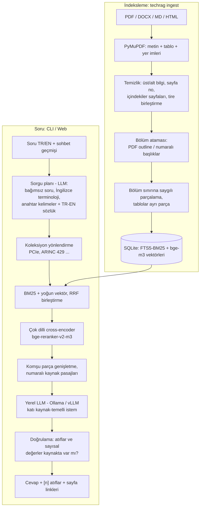

# techrag — Kapalı Ağda Çalışan Standart Asistanı (NotebookLM benzeri RAG)

Tamamen **internetsiz (air-gapped)** çalışan, cevaplarını **yalnızca yüklenen standart dokümanlarından** üreten
ve her bilgiyi **[n] atfıyla doküman / bölüm / sayfaya** bağlayan bir soru-cevap sistemi.

İlk kurulum şu standart aileleri için hazırlanmıştır (her biri ayrı bir *koleksiyon*):

| Koleksiyon | Kapsam (örnek) |
|---|---|
| `arinc` | ARINC 429, 664 (AFDX), 653, 818, 825 … |
| `ddr` | JEDEC DDR3 / DDR4 / DDR5 / LPDDR4/5 (JESD79-x) |
| `pcie` | PCI Express Base, CEM, M.2 |
| `ethernet` | IEEE 802.3, MII/RGMII/SGMII, TSN |
| `displayport` | VESA DisplayPort, eDP |
| `usb` | USB 2.0 / 3.x / USB4, Type-C, Power Delivery |
| `rs422` | TIA/EIA-422 (RS-422), RS-485 |
| `i2c` | I²C (UM10204), SMBus, I3C |
| `general` | DO-254, DO-160, DO-178C, MIL-STD-461/704, IPC, IEC … |

Yeni bir aile eklemek için `config/domains.yaml`'a bir blok ekleyip `data/sources/<anahtar>/` klasörü açmanız yeterlidir.

---

## 1. Mimari



Hiçbir bileşen dışarıya istek atmaz: modeller yerel klasörden yüklenir (`HF_HUB_OFFLINE=1` zorlanır),
web arayüzü CDN kullanmaz, LLM yerel sunucudadır.

### Doğru cevap için alınan önlemler

| Sorun | Önlem |
|---|---|
| Standart PDF'lerinde gürültü | Tekrarlayan üst/alt bilgi, sayfa numarası ve **içindekiler/şekil listesi sayfaları** atılır (aksi halde aramada "en alakalı" sayfa TOC çıkar). |
| Bağlamını kaybeden parçalar | Parçalar **bölüm sınırını aşmaz**; her parça `4 Physical Layer > 4.2 … > 4.2.6.3 Polling` gibi bölüm yolu ve sayfa aralığı taşır; bu yol embedding metnine de eklenir. |
| Tablolardaki değerler (zamanlama, pin, gerilim) | Tablolar Markdown tablo olarak **ayrı parça** olur, büyük tablolar başlık satırı tekrarlanarak bölünür, tablo başlığı ("Table 4-12 …") eklenir. |
| `tRFC`, `LTSSM`, `0x1F`, `128b/130b` gibi birebir terimler | **Hibrit arama**: BM25 (FTS5) birebir terimleri, vektör araması anlamı yakalar; ikisi RRF ile birleşir. |
| Türkçe soru – İngilizce doküman | Çok dilli `bge-m3` + `bge-reranker-v2-m3`; LLM ile soru **İngilizce standart terminolojisine** çevrilir; ayrıca deterministik **TR→EN terim sözlüğü** (gerilim→voltage, sonlandırma→termination …) ve kısaltma açılımları (LTSSM, SSM, tRFC …). |
| "Peki DDR5 için?" gibi takip soruları | Sorgu planlayıcı geçmişi kullanarak soruyu bağımsız hale getirir. |
| Yanlış standarttan cevap (DDR4 ↔ DDR5, PCIe ↔ USB "Gen 2") | Soruda açıkça geçen standart adı aramayı o koleksiyona **daraltır**; istem, versiyonları karıştırmamayı ve çelişkiyi belirtmeyi şart koşar. |
| Halüsinasyon | İstem: yalnızca kaynaklar, her cümlede [n], sayıları **birebir kopyala**, yoksa "Bu bilgi sağlanan kaynaklarda bulunamadı." Sıcaklık 0.1. |
| Uydurma sayı / yanlış atıf | **Doğrulama katmanı**: cevaptaki her sayı kaynak pasajlarda aranır, var olmayan [n] atıfları yakalanır → arayüzde uyarı. İsteğe bağlı `self_correct` ile LLM cevabı düzeltir. |
| Kesik bağlam | Ollama'da `num_ctx` (varsayılan 16384) açıkça gönderilir; bulunan parçanın aynı bölümdeki komşuları da eklenir. |

---

## 2. Donanım ve model önerileri

| Donanım | LLM (Ollama etiketi) | Not |
|---|---|---|
| Sadece CPU, ≥32 GB RAM | `qwen3:8b` veya `qwen3:30b-a3b` (MoE) | Çalışır ama yavaştır; `reranker.candidates: 20` yapın. |
| 1× GPU 16 GB | **`qwen3:14b`** (varsayılan) | İyi denge, Türkçe cevap kalitesi iyi. |
| 1× GPU 24 GB | `qwen3:32b`, `gemma3:27b`, `gpt-oss:20b` | Daha iyi muhakeme ve tablo okuma. |
| 2+ GPU / ≥48 GB | `llama3.3:70b`, `qwen2.5:72b` (vLLM ile `provider: openai`) | En yüksek doğruluk. |

* Embedding: `BAAI/bge-m3` (çok dilli, 1024 boyut). Reranker: `BAAI/bge-reranker-v2-m3`. İkisi birlikte ~4.5 GB disk.
* GPU varsa `embedding.device: cuda` ve `reranker.device: cuda` yapın; büyük bir standardın indekslenmesi CPU'da
  onlarca dakika sürebilirken GPU'da birkaç dakikaya iner.
* Daha yeni bir model kullanacaksanız `eval/questions.yaml` ile mevcut modelle **karşılaştırarak** seçin.
* Torch kurulamayan ortamlar için hafif mod: `embedding.backend: ollama`, `embedding.model: bge-m3`
  (`ollama pull bge-m3`) ve `reranker.enabled: false`. Doğruluk bir miktar düşer.

---

## 3. Kurulum

### 3.1 İnternetli makinede paket hazırlama

Hedef makineyle **aynı işletim sistemi, CPU mimarisi ve Python sürümü** olan bir makinede:

```bash
git clone <bu repo> techrag && cd techrag
# Ollama'yı bu makineye kurun (https://ollama.com) ve servisini başlatın, sonra:
TORCH=cpu LLM_MODELS="qwen3:14b" ./scripts/prepare_offline_bundle.sh offline_bundle
#   GPU hedefi için: TORCH=cuda
#   Ollama ile embedding kullanacaksanız: LLM_MODELS="qwen3:14b bge-m3"
```

`offline_bundle/` içinde: Python wheel'leri, `models/bge-m3`, `models/bge-reranker-v2-m3`, Ollama ikilisi ve
LLM ağırlıkları, proje kaynağı. Bu klasörü (USB/DVD/veri diyotu ile) kapalı ağa taşıyın.

### 3.2 Kapalı ağda kurulum

```bash
mkdir techrag && tar -xzf offline_bundle/techrag-src.tgz -C techrag && cd techrag
./scripts/install_offline.sh ../offline_bundle
ollama serve &                 # veya: sudo systemctl enable --now ollama
.venv/bin/techrag doctor       # her şey [OK ] olmalı (indeks henüz boşsa o satır XX olur)
```

### 3.3 Docker ile (alternatif)

```bash
# internetli makinede
docker compose build && docker pull ollama/ollama:latest
docker save techrag:latest ollama/ollama:latest | gzip > techrag-images.tgz
# kapalı ağda
docker load < techrag-images.tgz
mkdir -p models ollama && cp -r offline_bundle/models/* models/ && cp -r offline_bundle/ollama/models ollama/
docker compose up -d && docker compose exec techrag techrag ingest
```

### 3.4 Servis olarak çalıştırma

`deploy/techrag.service` örnek systemd birimidir (`/opt/techrag` altına kurulum varsayılır).

---

## 4. Dokümanları ekleme

```
data/sources/
├── arinc/        ARINC_429P1-19.pdf, ARINC_664P7.pdf ...
├── ddr/          JESD79-4C_DDR4.pdf, JESD79-5B_DDR5.pdf ...
├── pcie/         PCIe_Base_Spec_5.0.pdf ...
├── ethernet/  displayport/  usb/  rs422/  i2c/
└── general/      DO-254.pdf, MIL-STD-461G.pdf ...
```

* Klasör adı koleksiyonu belirler (`config/domains.yaml` → `folders`). Kök klasöre bırakılan dosyalar dosya adı
  ve içeriğe göre otomatik sınıflandırılır.
* **Dosya adına standart adını ve sürümünü yazın** (`PCIe_Base_Spec_5.0.pdf`): doküman adı her kaynak
  pasajında LLM'e gösterilir ve versiyon ayrımını kolaylaştırır.
* **Taranmış (resim) PDF'ler** metin içermez; önce OCR yapın: `ocrmypdf girdi.pdf cikti.pdf`.
  İndeksleme bu durumu uyarı olarak raporlar.
* Desteklenen türler: `.pdf .docx .md .txt .html`.

```bash
techrag ingest              # artımlı: değişmeyen dosyalar atlanır, silinen dosyalar indeksten çıkar
techrag ingest --rebuild    # embedding modeli / parçalama ayarı değiştiyse
techrag docs                # indekslenen dokümanlar
techrag inspect data/sources/pcie/PCIe_Base_Spec_5.0.pdf --limit 5   # parçalamayı gözle kontrol
```

Web arayüzündeki **"Kaynak ekle"** ile de dosya yükleyip indeksleyebilirsiniz (`server.allow_upload`).

---

## 5. Kullanım

### Web arayüzü (NotebookLM benzeri)

```bash
techrag serve               # http://127.0.0.1:8000  (ağdan erişim: server.host: 0.0.0.0 + api_token)
```

* **Sol panel – Kaynaklar:** koleksiyonlar ve dokümanlar. Hiçbir şey seçilmezse tüm kaynaklarda aranır
  (soruda geçen standart adı aramayı otomatik daraltır). Doküman/koleksiyon seçerek "defter" gibi kapsam
  belirleyebilirsiniz. Doküman adına tıklayınca içindekiler ve sayfa linkleri açılır.
* **Orta panel – Sohbet:** cevap akarak gelir; `[n]` atıflarına tıklayınca kaynak pasajı açılır.
  Altında arama planı (İngilizce sorgu, yönlendirilen koleksiyon) ve **doğrulama kutusu** görünür:
  ✓ yeşil = atıflar geçerli ve sayılar kaynakta bulundu; ⚠ sarı = kontrol edilmesi gereken değerler.
* **Sağ panel – Kaynak / Notlar:** pasajın tam metni, "Orijinal dokümanda aç (s. N)" linki (PDF doğrudan
  o sayfada açılır); beğendiğiniz cevapları **not** olarak kaydedip Markdown olarak indirebilirsiniz.

### Komut satırı

```bash
techrag ask "PCIe LTSSM Polling durumunun alt durumları nelerdir?"
techrag ask -d ddr "tRFC 16Gb için kaç ns?"          # koleksiyonla sınırla
techrag ask --json "I2C Fm+ yükselme süresi?"         # yapılandırılmış çıktı (kaynaklar + doğrulama)
techrag chat                                          # takip soruları ile sohbet
techrag search "ARINC 429 SSM BNR" --no-rewrite       # sadece arama: hangi pasajlar geliyor?
techrag stats | techrag doctor
```

### HTTP API

| Uç nokta | Açıklama |
|---|---|
| `POST /api/ask` | `{question, history?, domains?, doc_ids?, top_k?, stream?}` → SSE olayları: `plan`, `sources`, `token`, `replace`, `done` (`stream:false` ile tek JSON) |
| `POST /api/search` | Yalnızca arama, numaralı pasajlar |
| `GET /api/documents`, `/api/documents/{id}`, `/api/documents/{id}/file` | Doküman listesi, içindekiler, orijinal dosya |
| `POST /api/upload`, `POST /api/ingest`, `GET /api/jobs/{id}` | Yükleme ve indeksleme işleri |
| `GET /api/info`, `GET /api/health` | Durum |

`server.api_token` doluysa `Authorization: Bearer <token>` gerekir.

---

## 6. Doğruluğu ölçme ve iyileştirme

```bash
techrag eval --retrieval-only   # LLM çağırmadan: doğru pasaj geliyor mu? (context recall)
techrag eval                    # tam akış: cevap doğruluğu + doğrulama oranı
```

`eval/questions.yaml` her koleksiyon için örnek sorular içerir; rapor `data/eval_reports/` altına yazılır.
Önerilen döngü:

1. Mühendislerin gerçek sorularıyla seti **100+ soruya** çıkarın (`expected` + mümkünse `expected_doc`).
2. `--retrieval-only` ile *context recall* ≥ %90 olana kadar arama tarafını ayarlayın:
   parçalama (`chunking.target_tokens`), `retrieval.final_top_k`, `reranker.candidates`, terim sözlüğü.
3. Sonra tam değerlendirme ile LLM'i / istemi karşılaştırın. Her değişiklikten sonra tekrar koşun.

Ayar ipuçları:

* Cevap "bulunamadı" ama bilgi dokümanda var → `techrag search` ile pasajlara bakın; gelmiyorsa
  `config/domains.yaml` → `term_map` / `glossary`'ye terim ekleyin veya `final_top_k`'yı artırın.
* Tablo değerleri yanlış hücreden okunuyor → `techrag inspect` ile tablo çıkarımını kontrol edin; bozuk
  tablolarda `chunking.extract_tables: false` denenebilir.
* Daha temkinli cevaplar için `answer.self_correct: true` (doğrulanamayan değer varsa ikinci LLM geçişi).

---

## 7. Konfigürasyon

Tüm ayarlar `config/config.yaml` içindedir (açıklamalı). Her değer ortam değişkeniyle ezilebilir:
`TECHRAG_<BÖLÜM>__<ANAHTAR>`, örn. `TECHRAG_LLM__MODEL=qwen3:32b`, `TECHRAG_RERANKER__DEVICE=cuda`.
Farklı bir dosya: `techrag -c /yol/config.yaml ...` veya `TECHRAG_CONFIG=...`.

vLLM / llama.cpp / LM Studio kullanımı:

```yaml
llm:
  provider: openai
  base_url: http://localhost:8001/v1
  model: Qwen/Qwen3-32B
```

---

## 8. Sorun giderme

| Belirti | Çözüm |
|---|---|
| `LLM server unreachable` | `ollama serve` çalışıyor mu? `llm.base_url` doğru mu? `techrag doctor` |
| `model 'x' not found on server` | `ollama list`; modeli paketle taşıyıp `~/.ollama/models` altına kopyalayın. |
| `Index was built with embedding model ...` | Embedding modelini değiştirdiniz: `techrag ingest --rebuild` |
| Model HuggingFace'e bağlanmaya çalışıyor | `embedding.model` yerel klasörü göstermeli (`models/bge-m3`); `offline: true` kalmalı. |
| Cevaplar çok yavaş (CPU) | `reranker.candidates: 20`, `retrieval.final_top_k: 6`, daha küçük LLM; GPU varsa `device: cuda`. |
| Cevap yarıda kesiliyor / kaynakları görmüyor | `llm.num_ctx` artırın (≥16384), `llm.max_tokens` yeterli mi? |
| Bir PDF'ten hiç parça çıkmıyor | Taranmış PDF → OCR. `techrag docs` uyarıları gösterir. |

---

## 9. Proje yapısı

```
techrag/
  config.py        konfigürasyon (YAML + ortam değişkenleri, offline zorlaması)
  domains.py       koleksiyon tespiti, TR→EN terim sözlüğü, kısaltma açılımları
  ingest/          loaders (PDF/DOCX/MD/HTML) · cleaning · structure (bölümler) · chunker · pipeline
  store.py         SQLite: dokümanlar, parçalar, FTS5 (BM25), float16 vektörler
  embeddings.py    sentence-transformers / Ollama / OpenAI-uyumlu embedding
  reranker.py      cross-encoder yeniden sıralama
  query.py         sorgu planlama (takip sorusu, çeviri, anahtar kelime)
  retrieval.py     hibrit arama, RRF, rerank, komşu genişletme, pasajlar
  prompts.py       istemler
  llm.py           Ollama / OpenAI-uyumlu akış istemcisi (<think> filtreleme)
  verify.py        atıf ve sayısal değer doğrulaması
  engine.py        uçtan uca akış
  evaluation.py    değerlendirme
  server.py, web/  FastAPI + çevrimdışı tek sayfa arayüz
  cli.py           komut satırı
config/            config.yaml, domains.yaml
eval/              questions.yaml
scripts/           prepare_offline_bundle.sh, install_offline.sh, download_models.py
tests/             pytest (sentetik standart PDF + sahte LLM ile uçtan uca testler)
```

Testler: `pip install pytest && python -m pytest` (model veya GPU gerektirmez).

> **Lisans notu:** Standart dokümanları (ARINC, JEDEC, PCI-SIG, VESA, USB-IF, IEEE …) lisanslı içeriktir.
> `data/sources/` git'e eklenmez (`.gitignore`); yalnızca kurumunuzun lisansı kapsamında kullanın.
