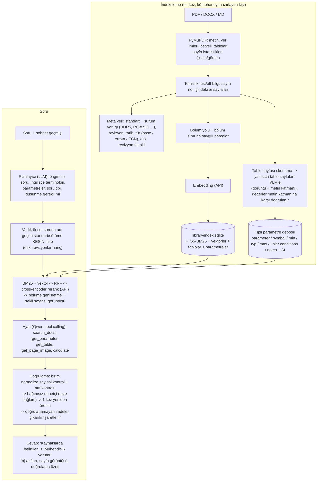

# TechRAG — Arayüz ve Tasarım Standartları için Doğrulamalı Asistan

Kullanıcının arayüz/standart sorularını (ARINC, JEDEC DDR, PCIe, Ethernet, DisplayPort, USB, RS-422, I²C,
genel tasarım standartları …) **yalnızca yüklü dokümanlardan** cevaplayan, her ifadeyi **[n] atfıyla sayfasına**
bağlayan ve cevabı kullanıcıya göstermeden önce **kaynaklara karşı denetleyen** bir masaüstü uygulaması.

* Windows için tek `TechRAG.exe` (tarayıcı açılmaz; yerel pencere — Microsoft Edge WebView2).
* Tüm modeller kurum içindeki **vLLM / SGLang** sunucularından (OpenAI uyumlu API) kullanılır:
  sohbet modeli, görsel model, embedding ve reranker ayrı ayrı ayarlanır. Yerelde ağır hiçbir şey çalışmaz.
* Arayüz Türkçe / İngilizce (tek tıkla değişir). Cevap, sorunun dilinde verilir; teknik terimler İngilizce kalır.

---

## 1. Mimari



### Halüsinasyona karşı katmanlar

| Hata kaynağı | Önlem |
|---|---|
| Yanlış standart / sürüm (DDR4 değeri DDR5 cevabında) | Her doküman standart+sürüm varlığıyla etiketlenir; soruda adı geçen standart aramayı **kesin** olarak o dokümanlara daraltır. Araç çağrıları da bu kapsamı miras alır. Eski revizyonlar (aynı standardın daha yeni sürümü varsa) aramadan çıkarılır; errata/ECN kaynakları "base dokümanı geçersiz kılar" diye işaretlenir. |
| Tablo satırının bölünmesi, OCR bozulması | Tablo sayfaları **görsel modele** (VLM) gönderilir; birleşik hücreler çözülür, hız sınıfı / mod sütunları satırlara açılır, dipnotlar satıra eklenir. VLM'in yazdığı **her sayı sayfanın metin katmanında aranır**; tutmayan satırlar "doğrulanmamış" olur, çoğu tutmayan tablo hiç kullanılmaz. |
| Sayısal değer uydurma | Sayısal sorular önce **tipli parametre deposundan** (min/typ/max/birim/koşul) cevaplanır. Hesaplar `calculate` aracıyla yapılır (modelin kafadan aritmetiği yasak). |
| Bağlam kaybı | Küçük parça ile bulunur, **bölümün tamamı** (kısaysa) bağlama verilir; şekil/zamanlama diyagramı içeren sayfalar **görüntü olarak** modele eklenir. Bağlam ~16K token ile sınırlı tutulur (ham sayfa yığını değil, rerank edilmiş içerik). |
| Model "biliyorum" diye uyduruyor | Cevap sözleşmesi: her ifade [n] atıflı; "Kaynaklarda belirtilen" ile "Mühendislik yorumu" ayrı; "yüklü dokümanlarda bulunamadı" cevabı her zaman kabul. |
| Yine de hatalı ifade | **Deterministik doğrulayıcı**: her sayı+birim, *atıf yapılan* kaynakta (birim dönüşümüyle: 0,35 µs = 350 ns) aranır; yanlış kaynağa atıf yakalanır. **Bağımsız denetçi**: aynı model, taze bağlamda yalnızca iddia + atıf yapılan kaynakla "destekleniyor / kısmen / desteklenmiyor" der (yanlış koşula bağlanmış değerleri yakalar). Hatalı ifadeler bir kez yeniden üretilir; hâlâ hatalıysa cevaptan **çıkarılır** (veya ayarla ⚠ ile işaretlenir) ve kullanıcıya listelenir. |

### Yerel hesaplama bütçesi

| Yerelde (exe) | Sunucuda (vLLM) |
|---|---|
| PDF ayrıştırma (PyMuPDF), sayfa render (yalnızca VLM sayfaları ve görüntülenen sayfalar), SQLite FTS5, numpy ile vektör arama (100 bin parçaya kadar ms düzeyi), birim/sayı doğrulama | Sohbet + görsel model, embedding, reranker |

Exe ~65 MB (tek dosya); GPU, torch veya model dosyası gerektirmez.

**Soru başına LLM çağrısı (doğruluk öncelikli mod):** planlayıcı 1 + cevap 1 (+ araç turları, en fazla 4) +
denetçi 1–2 (paralel) + gerekirse yeniden üretim 1 + yeniden denetim. Embedding 1, rerank 1 istek.

---

## 2. Kurulum

### 2.1 Exe'yi almak

GitHub Actions her push'ta Windows derlemesi yapar (**Actions → Build Windows exe → Artifacts → TechRAG-windows**):

* `TechRAG-portable.exe` — tek dosya, kopyala-çalıştır.
* `TechRAG-win64.zip` — klasör sürümü (daha hızlı açılır; `TechRAG.exe` içinde).

`v*` etiketi atılırsa (ör. `git tag v1.0.0 && git push --tags`) dosyalar GitHub Release'e de eklenir.
Derleme, dondurulmuş exe üzerinde `TechRAG.exe selftest` çalıştırarak PDF ayrıştırma, indeksleme, arama,
gömülü arayüz ve pywebview'in pakete girdiğini doğrular. Exe'yi kapalı ağa normal dosya olarak taşıyın.

**Gereksinim:** Microsoft Edge **WebView2 Runtime** (Windows 11'de hazır; Windows 10'da yoksa Microsoft'un
"Evergreen Standalone Installer" çevrimdışı kurulumunu bir kez çalıştırın).

### 2.2 Model sunucuları (vLLM)

`deploy/vllm-serve-example.sh` dört uç nokta için örnek komutları içerir. Önemli bayraklar:

* Sohbet modeli: `--enable-auto-tool-choice --tool-call-parser hermes` (araçlar için) ve
  `--reasoning-parser qwen3` (düşünme metni cevaba karışmasın). Görsel giriş için `--limit-mm-per-prompt`.
  Modelinizin kartında önerilen parser adlarını kullanın.
* Embedding: `--runner pooling` (eski sürümlerde `--task embed`), ör. Qwen3-Embedding-0.6B.
* Reranker: Qwen3-Reranker için `--hf_overrides` (dosyada); bge-reranker-v2-m3 ek ayar istemez.

Sunucu araç çağrısını desteklemiyorsa uygulama bunu fark eder ve araçsız (ön-getirilmiş kaynaklarla) devam eder.

### 2.3 İlk açılış: Ayarlar

**Ayarlar** penceresinde her servis için **API adresi** (`http://sunucu:8000/v1`), **API anahtarı** ve
**Model** girilir. Model listesi sunucunun `/v1/models` ucundan **otomatik çekilir** ve açılır listede gösterilir;
**Test et** düğmesi bağlantıyı ve modeli dener (embedding boyutu, rerank skoru, LLM cevabı).

* Görsel model: "Sohbet modeliyle aynı" (çok kipli Qwen: şekil sayfaları cevap modeline görüntü olarak gider)
  veya ayrı bir VLM (sohbet modeli yalnızca metin alıyorsa sayfa görüntüleri VLM tarafından metne dökülür).
* Düşünme modu: `auto` (karşılaştırma / çok parçalı sorularda açık), `on`, `off`; kontrol yöntemi
  `chat_template` (Qwen `enable_thinking`) veya `reasoning_effort`.
* Doğrulanamayan iddialar: **Kaldır** (varsayılan) veya **İşaretle**.

Ayarlar `%APPDATA%\TechRAG\settings.json` dosyasına yazılır; API anahtarları **Windows DPAPI** ile kullanıcı
hesabına bağlı şifrelenir.

---

## 3. Kütüphane

```
<kütüphane>\
├── sources\
│   ├── arinc\        ARINC_429P1-19.pdf, ARINC_664P7.pdf ...
│   ├── ddr\          JESD79-4C_DDR4.pdf, JESD79-5B_DDR5.pdf ...
│   ├── pcie\         PCIe_Base_5.0.pdf, PCIe_CEM_4.0.pdf, PCIe_Base_5.0_Errata.pdf ...
│   ├── ethernet\  displayport\  usb\  rs422\  i2c\  general\
│   └── <yeni-grup>\  (tanımsız klasör otomatik olarak yeni koleksiyon olur)
├── index.sqlite      (FTS5 + vektörler + tablolar + parametreler)
└── cache\vlm\        (VLM ve meta veri sonuçları; aynı sayfa ikinci kez ücretlendirilmez)
```

* Varsayılan konum `%USERPROFILE%\TechRAG\library`; **Kütüphane** penceresinden değiştirilir.
* **Doküman ekle**: koleksiyon (klasör) seçin, dosyaları seçin → kopyalanır ve indekslenir (ilerleme görünür).
  Dosya adına standart ve sürümü yazmak etiketlemeyi kesinleştirir (`JESD79-5B_DDR5.pdf`, `PCIe_Base_5.0.pdf`).
  Errata/ECN dosyalarının adında "Errata"/"ECN" geçsin.
* Standart/sürüm kalıpları `techrag/resources/domains.yaml` içindedir (koleksiyon klasörleri, desenler,
  kısaltma sözlüğü, Türkçe→İngilizce terimler). Yeni bir standart ailesi bir YAML bloğu ile eklenir.
* Taranmış PDF'ler önce OCR'dan geçirilmeli (`ocrmypdf`); VLM metin katmanı olmayan sayfaların değerlerini
  doğrulayamaz.

**Paylaşım:** kütüphaneyi hazırlayan kişi **Kütüphane → Yayımla** ile temiz bir kopya üretir (tek dosya
indeks + kaynaklar + VLM önbelleği). Diğer kullanıcılar bu klasörü (ağ paylaşımı dahil, `\\sunucu\paylaşım\...`)
**salt-okunur** açar: kilit kullanmaz, ağ paylaşımında güvenlidir. Güncellemeyi yeni bir klasöre yayımlayıp
kullanıcıların onu açması önerilir (açıkken üzerine yazmayın).

---

## 4. Kullanım

* **Soru:** Sorunuzu yazın. Soruda geçen standart/sürüm kapsamı belirler ("kapsam: DDR5"); soldan doküman
  seçerek kapsamı elle de daraltabilirsiniz.
* **Cevap akışı:** önce taslak (soluk) akar, araç çağrıları ve isteğe bağlı model düşünmesi görünür; doğrulama
  bitince taslak, **doğrulanmış son cevapla** değişir.
* **Doğrulama kutusu:** "12/12 ifade doğrulandı", "1 ifade çıkarıldı" (gerekçesiyle), "bulunamadı".
* **Kaynak görüntüleyici:** [n]'e tıklayın → kaynak metni + **ilgili sayfanın görüntüsü** (önceki/sonraki,
  yakınlaştırma, orijinal dosyayı sistem PDF görüntüleyicisinde açma).
* **Notlar:** cevapları kaydedin, Markdown olarak dışa aktarın.

### Komut satırı (aynı exe)

```bat
TechRAG.exe doctor                    :: uç noktalar, modeller, indeks kontrolü
TechRAG.exe models                    :: her uç noktanın sunduğu modeller
TechRAG.exe ingest                    :: artımlı indeksleme (VLM tablo çıkarımı dahil)
TechRAG.exe ingest --rebuild          :: embedding modeli değişince
TechRAG.exe inspect dosya.pdf --table-pages   :: parçalama ve VLM'e gidecek sayfalar
TechRAG.exe search "DDR5 tRFC 16Gb"   :: yalnızca arama (kapsam, pasajlar, parametre satırları)
TechRAG.exe ask "PCIe 5.0 LTSSM Polling alt durumları?"
TechRAG.exe publish \\sunucu\paylasim\techrag-2026-10
TechRAG.exe eval eval\questions.yaml  :: değerlendirme
```

Kaynak koddan: `pip install -r requirements-desktop.txt` → `python -m techrag.desktop` (pencere) veya
`python -m techrag <komut>`; tarayıcıda geliştirme için `python -m techrag serve`.

---

## 5. Doğruluğu ölçme

```bat
TechRAG.exe eval --retrieval-only     :: LLM'siz: recall@1/3/5/8, MRR (doğru sayfa geldi mi?)
TechRAG.exe eval                      :: + cevap doğruluğu, faithfulness, çıkarılan ifade oranı
```

`eval/questions.yaml` örnek bir settir; her maddeye `expected_doc` ve `expected_pages` ekleyin. Önerilen döngü:
mühendislerin gerçek sorularıyla birkaç yüz soruluk altın set → önce **recall@k** (ayrıştırma, parçalama,
VLM sayfa eşiği `vision.min_page_score`, rerank aday sayısı) → sonra **faithfulness**. Yanlış cevapların
kökü neredeyse her zaman ayrıştırma veya varlık (standart/sürüm) etiketlemesindedir: `TechRAG.exe docs` ve
`inspect` ile kontrol edin.

---

## 6. Sorun giderme

| Belirti | Çözüm |
|---|---|
| Pencere açılmıyor | WebView2 Runtime kurulu mu? Günlük: `%APPDATA%\TechRAG\techrag.log` |
| "no chat/embedding model configured" | Ayarlar → model seçin; `TechRAG.exe doctor` |
| "indexed with embedding model …" | Embedding modeli değişti: Kütüphane → "Tamamen yeniden oluştur" veya `ingest --rebuild` |
| Araç kullanılmıyor | vLLM'i `--enable-auto-tool-choice --tool-call-parser …` ile başlatın |
| Cevapta `<think>` / düşünme metni | vLLM'de `--reasoning-parser` kullanın veya Ayarlar → Düşünme `off` |
| Tablolar boş / "failed value verification" | Görsel model tanımlı mı, metin katmanı var mı (OCR)? `inspect --table-pages` |
| Soru yanlış standarda gidiyor | `TechRAG.exe docs` ile doküman etiketlerini kontrol edin; dosya adına standart/sürüm yazın veya `domains.yaml` desenlerini genişletin |

---

## 7. Proje yapısı

```
techrag/
  desktop.py       exe giriş noktası: süreç içi FastAPI + pywebview penceresi, argümanla CLI
  server.py        API: ayarlar (model listesi/test), kütüphane, dokümanlar, sayfa görüntüsü, SSE soru akışı
  engine.py        plan -> kapsamlı arama -> ajan döngüsü -> doğrulama/denetçi/yeniden üretim
  tools.py         ajan araçları + atıf kayıt defteri + güvenli hesap makinesi
  verify.py        iddia ayırma, birim duyarlı deterministik kontrol, çıkarma/işaretleme
  retrieval.py     varlık kapsamı, BM25+vektör+RRF+rerank, bölüme genişletme, şekil sayfaları
  query.py         planlayıcı;  domains.py  koleksiyon/standart varlıkları, TR->EN terimler
  ingest/          loaders, cleaning, structure, chunker, metadata, vlm (tablo çıkarımı), pipeline
  store.py         SQLite indeks, parametre deposu, salt-okunur açma, yayımlama
  api.py, llm.py, embeddings.py, reranker.py   OpenAI uyumlu istemciler (vLLM)
  units.py         nicelik ayrıştırma ve SI normalizasyonu
  config.py, settings.py   katmanlı ayarlar, DPAPI ile şifreli API anahtarları
  web/             çevrimdışı arayüz (TR/EN);  resources/domains.yaml
packaging/         PyInstaller spec + giriş;  .github/workflows/windows-build.yml
deploy/            vLLM örnek komutları
tests/             79 test (sahte OpenAI uyumlu sunucu ile uçtan uca)
```

> Standart dokümanları lisanslı içeriktir; kütüphane klasörü git'e eklenmez.
